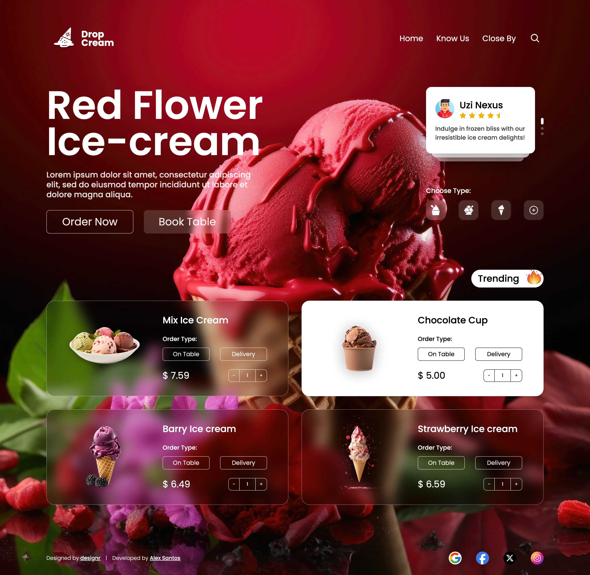

# Drop cream landing page

## 📌 Overview

This project is landing page for a ice cream store using **React**, **TypeScript**, and **TailwindCSS**.

---

## 🖼️ Screenshots

<div style="display:flex; flex-direction:column; gap: 12px;">
  
  
</div>

---

## 🛠 Getting Started

### ✅ Prerequisites

- Node.js `v18+`
- npm or yarn

### ⚡ Setup

```bash
# Clone repo
git clone git@github.com:alexsantosquispe/drop-cream-page.git
cd drop-cream-page

# Install dependencies
npm install

# Run development server
npm run dev
```

Visit `http://localhost:5173` to view the app.

---
